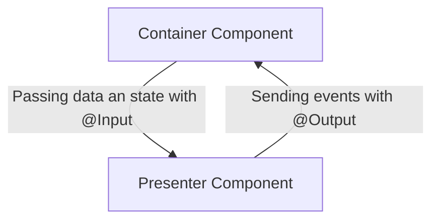

---

## Components structure

```
/src/app/shared/
├── app
│   ├── components
│   │   ├── media
│   │   │   ├── MediaContainerComponent
│   │   │   └── MediaPresenterComponent
│   │   │   └── MediaDetailComponent
│   │   │   │    ├── MediaDetailPictureComponent
│   │   │   │    └── ...
│   │   ├── search
│   │   │   └── SearchComponent
│   │   ├── tabs
│   │   │   └── TabSwitcherComponent
```
